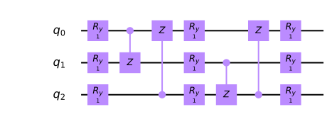
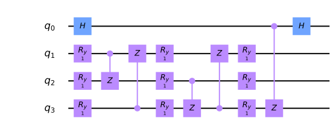
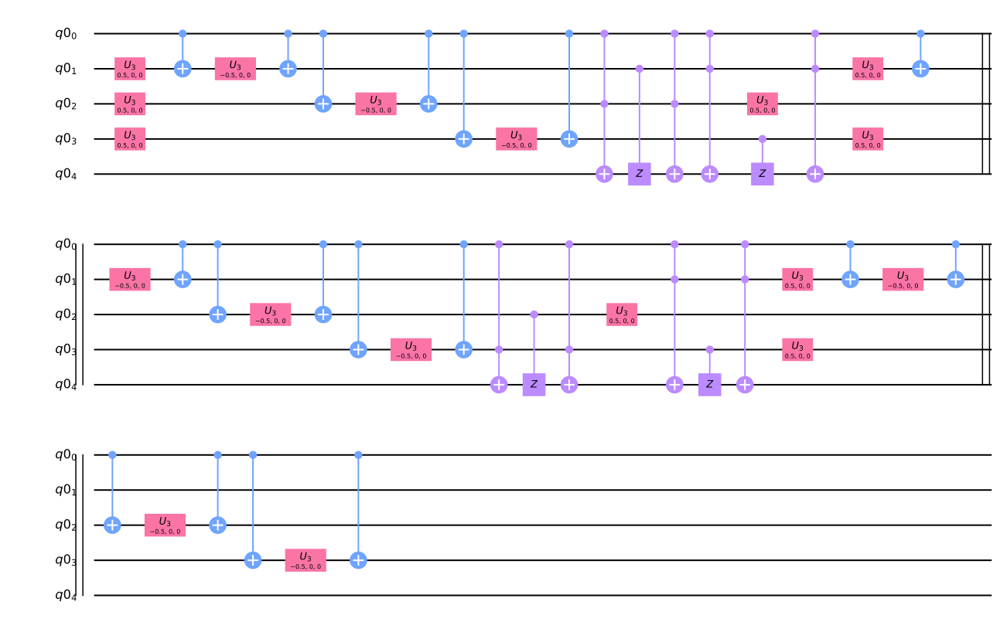
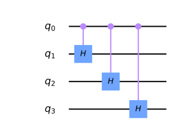

.. raw:: html

.. contents:: Contents
   :local:

   <h1>

The Variational Quantum Linear Solver

.. raw:: html

   </h1>

.. code:: ipython3

    import qiskit
    from qiskit import QuantumCircuit, QuantumRegister, ClassicalRegister
    from qiskit import Aer, execute
    import math
    import random
    import numpy as np
    from scipy.optimize import minimize
    %config InlineBackend.figure_format = 'svg' # Makes the images look nice

**Introduction**

The Variational Quantum Linear Solver, or the VQLS is a variational
quantum algorithm that utilizes VQE in order to solve systems of linear
equations more efficiently than classical computational algortihms.
Specifically, if we are given some matrix :math:`\textbf{A}`, such that
:math:`\textbf{A} |\textbf{x}\rangle \ = \ |\textbf{b}\rangle`, where
:math:`|\textbf{b}\rangle` is some known vector, the VQLS algorithm is
theoretically able to find a normalized :math:`|x\rangle` that is
proportional to :math:`|\textbf{x}\rangle`, which makes the above
relationship true.

The output of this algorithm is identical to that of the HHL Quantum
Linear-Solving Algorithm, except, while HHL provides a much more
favourable computation speedup over VQLS, the variational nature of our
algorithm allows for it to be performed on NISQ quantum computers, while
HHL would require much more robust quantum hardware, and many more
qubits.

**The Algorithm**

To begin, the inputs into this algorithm are evidently the matrix
:math:`\textbf{A}`, which we have to decompose into a linear combination
of unitaries with complex coefficients:

.. math:: A \ = \ \displaystyle\sum_{n} c_n \ A_n

Where each :math:`A_n` is some unitary, and some unitary :math:`U` that
prepares state :math:`|\textbf{b}\rangle` from :math:`|0\rangle`. Now,
recall the general structure of a variational quantum algorithm. We have
to construct a quantum cost function, which can be evaluated with a
low-depth parametrized quantum circuit, then output to the classical
optimizer. This allows us to search a parameter space for some set of
parameters :math:`\alpha`, such that
:math:`|\psi(\alpha)\rangle \ = \ \frac{|\textbf{x}\rangle}{|| \textbf{x} ||}`,
where :math:`|\psi(k)\rangle` is the output of out quantum circuit
corresponding to some parameter set :math:`k`.

Before we actually begin constructing the cost function, let’s take a
look at a “high level” overview of the sub-routines within this
algorithm, as illustrated in this image from the original paper:

.. figure:: images/bro.png
   :alt: alt text

So essentially, we start off with a qubit register, with each qubit
initialized to :math:`|0\rangle`. Our algorithm takes its inputs, then
prepares and evaluates the cost function, starting with the creation of
some ansatz :math:`V(\alpha)`. If the computed cost is greater than some
parameter :math:`\gamma`, the algorithm is run again with updated
parameters, and if not, the algorithm terminates, and the ansatz is
calculated with the optimal parameters (determined at termination). This
gives us the state vector that minimizes our cost function, and
therefore the normalized form of :math:`|\textbf{x}\rangle`.

Let’s start off by considering the ansatz :math:`V(\alpha)`, which is
just a circuit that prepares some arbitrary state
:math:`|\psi(k)\rangle`. This allows us to “search” the state space by
varying some set of parameters, :math:`k`. Anyways, the ansatz that we
will use for this implementation is given as follows:

.. code:: ipython3

    def apply_fixed_ansatz(qubits, parameters):
    
        for iz in range (0, len(qubits)):
            circ.ry(parameters[0][iz], qubits[iz])
    
        circ.cz(qubits[0], qubits[1])
        circ.cz(qubits[2], qubits[0])
    
        for iz in range (0, len(qubits)):
            circ.ry(parameters[1][iz], qubits[iz])
    
        circ.cz(qubits[1], qubits[2])
        circ.cz(qubits[2], qubits[0])
    
        for iz in range (0, len(qubits)):
            circ.ry(parameters[2][iz], qubits[iz])
    
    circ = QuantumCircuit(3)
    apply_fixed_ansatz([0, 1, 2], [[1, 1, 1], [1, 1, 1], [1, 1, 1]])
    circ.draw(output='mpl')

This is called a **fixed hardware ansatz**: the configuration of quantum
gates remains the same for each run of the circuit, all that changes are
the parameters. Unlike the QAOA ansatz, it is not composed solely of
Trotterized Hamiltonians. The applications of :math:`Ry` gates allows us
to search the state space, while the :math:`CZ` gates create
“interference” between the different qubit states.

Now, it makes sense for us to consider the actual **cost function**. The
goal of our algorithm will be to minimize cost, so when
:math:`|\Phi\rangle \ = \ \textbf{A} |\psi(k)\rangle` is very close to
:math:`|\textbf{b}\rangle`, we want our cost function’s output to be
very small, and when the vectors are close to being ortohognal, we want
the cost function to be very large. Thus, we introduce the “projection”
Hamiltonian:

.. math:: H_P \ = \ \mathbb{I} \ - \ |b\rangle \langle b|

Where we have:

.. math:: C_P \ = \ \langle \Phi | H_P | \Phi \rangle \ = \ \langle \Phi | (\mathbb{I} \ - \ |b\rangle \langle b|) |\Phi \rangle \ = \ \langle \Phi | \Phi \rangle \ - \ \langle \Phi |b\rangle \langle b | \Phi \rangle

Notice how the second term tells us “how much” of :math:`|\Phi\rangle`
lies along :math:`|b\rangle`. We then subtract this from another number
to get the desired low number when the inner product of
:math:`|\Phi\rangle` and :math:`|b\rangle` is greater (they agree more),
and the opposite for when they are close to being orthogonal. This is
looking good so far! However, there is still one more thing we can do to
increase the accuracy of the algorithm: normalizing the cost function.
This is due to the fact that if :math:`|\Phi\rangle` has a small norm,
then the cost function will still be low, even if it does not agree with
:math:`|\textbf{b}\rangle`. Thus, we replace :math:`|\Phi\rangle` with
:math:`\frac{|\Phi\rangle}{\sqrt{\langle \Phi | \Phi \rangle}}`:

.. math:: \hat{C}_P \ = \ \frac{\langle \Phi | \Phi \rangle}{\langle \Phi | \Phi \rangle} \ - \ \frac{\langle \Phi |b\rangle \langle b | \Phi \rangle}{\langle \Phi | \Phi \rangle} \ = \ 1 \ - \ \frac{\langle \Phi |b\rangle \langle b | \Phi \rangle}{\langle \Phi | \Phi \rangle} \ = \ 1 \ - \ \frac{|\langle b | \Phi \rangle|^2}{\langle \Phi | \Phi \rangle}

Ok, so, we have prepared our state :math:`|\psi(k)\rangle` with the
ansatz. Now, we have two values to calculate in order to evaluate the
cost function, namely :math:`|\langle b | \Phi \rangle|^2` and
:math:`\langle \Phi | \Phi \rangle`. Luckily, a nifty little quantum
subroutine called the **Hadamard Test** allows us to do this!
Essentially, if we have some unitary :math:`U` and some state
:math:`|\phi\rangle`, and we want to find the expectation value of
:math:`U` with respect to the state,
:math:`\langle \phi | U | \phi \rangle`, then we can evaluate the
following circuit:

.. figure:: images/h.png
   :alt: image1

Then, the probability of measuring the first qubit to be :math:`0` is
equal to :math:`\frac{1}{2} (1 \ + \ \text{Re}\langle U \rangle)` and
the probability of measuring :math:`1` is
:math:`\frac{1}{2} (1 \ - \ \text{Re}\langle U \rangle)`, so subtracting
the two probabilities gives us :math:`\text{Re} \langle U \rangle`.
Luckily, the matrices we will be dealing with when we test this
algorithm are completely real, so
:math:`\text{Re} \langle U \rangle \ = \ \langle U \rangle`, for this
specific implementation. Here is how the Hadamard test works. By the
circuit diagram, we have as our general state vector:

.. math:: \frac{|0\rangle \ + \ |1\rangle}{\sqrt{2}} \ \otimes \ |\psi\rangle \ = \ \frac{|0\rangle \ \otimes \ |\psi\rangle \ + \ |1\rangle \ \otimes \ |\psi\rangle}{\sqrt{2}}

Applying our controlled unitay:

.. math:: \frac{|0\rangle \ \otimes \ |\psi\rangle \ + \ |1\rangle \ \otimes \ |\psi\rangle}{\sqrt{2}} \ \rightarrow \ \frac{|0\rangle \ \otimes \ |\psi\rangle \ + \ |1\rangle \ \otimes \ U|\psi\rangle}{\sqrt{2}}

Then applying the Hadamard gate to the first qubit:

.. math:: \frac{|0\rangle \ \otimes \ |\psi\rangle \ + \ |1\rangle \ \otimes \ U|\psi\rangle}{\sqrt{2}} \ \rightarrow \ \frac{1}{2} \ \big[ |0\rangle \ \otimes \ |\psi\rangle \ + \ |1\rangle \ \otimes \ |\psi\rangle \ + \ |0\rangle \ \otimes \ U|\psi\rangle \ - \ |1\rangle \ \otimes \ U|\psi\rangle \big]

.. math:: \Rightarrow \ |0\rangle \ \otimes \ (\mathbb{I} \ + \ U)|\psi\rangle \ + \ |1\rangle \ \otimes \ (\mathbb{I} \ - \ U)|\psi\rangle

When we take a measurement of the first qubit, remember that in order to
find the probability of measuring :math:`0`, we must take the inner
product of the state vector with :math:`|0\rangle`, then multiply by its
complex conjugate (see the quantum mechanics section if you are not
familiar with this). The same follows for the probability of measuring
:math:`1`. Thus, we have:

.. math:: P(0) \ = \ \frac{1}{4} \ \langle \psi | (\mathbb{I} \ + \ U) (\mathbb{I} \ + \ U^{\dagger}) |\psi\rangle \ = \ \frac{1}{4} \ \langle \psi | (\mathbb{I}^2 \ + U \ + \ U^{\dagger} \ + \ U^{\dagger} U) |\psi\rangle \ = \ \frac{1}{4} \ \langle \psi | (2\mathbb{I} \ + U \ + \ U^{\dagger}) |\psi\rangle

.. math:: \Rightarrow \ \frac{1}{4} \Big[ 2 \ + \ \langle \psi | U^{\dagger} | \psi \rangle \ + \ \langle \psi | U | \psi \rangle \Big] \ = \ \frac{1}{4} \Big[ 2 \ + \ (\langle \psi | U | \psi \rangle)^{*} \ + \ \langle \psi | U | \psi \rangle \Big] \ = \ \frac{1}{2} (1 \ + \ \text{Re} \ \langle \psi | U | \psi \rangle)

By a similar procedure, we get:

.. math:: P(1) \ = \ \frac{1}{2} \ (1 \ - \ \text{Re} \ \langle \psi | U | \psi \rangle)

And so, by taking the difference:

.. math:: P(0) \ - \ P(1) \ = \ \text{Re} \ \langle \psi | U | \psi \rangle

Cool! Now, we can actually implement this for the two values we have to
compute. Starting with :math:`\langle \Phi | \Phi \rangle`, we have:

.. math:: \langle \Phi | \Phi \rangle \ = \ \langle \psi(k) | A^{\dagger} A |\psi(k) \rangle \ = \ \langle 0 | V(k)^{\dagger} A^{\dagger} A V(k) |0\rangle \ = \ \langle 0 | V(k)^{\dagger} \Big( \displaystyle\sum_{n} c_n \ A_n \Big)^{\dagger} \Big( \displaystyle\sum_{n} c_n \ A_n \Big) V(k) |0\rangle

.. math:: \Rightarrow \ \langle \Phi | \Phi \rangle \ = \ \displaystyle\sum_{m} \displaystyle\sum_{n} c_m^{*} c_n \langle 0 | V(k)^{\dagger} A_m^{\dagger} A_n V(k) |0\rangle

and so our task becomes computing every possible term
:math:`\langle 0 | V(k)^{\dagger} A_m^{\dagger} A_n V(k) |0\rangle`
using the Hadamard test. This requires us prepare the state
:math:`V(k) |0\rangle`, and then perform controlled operations with some
control-ancilla qubit for the unitary matrices :math:`A_m^{\dagger}` and
:math:`A_n`. We can implement this in code:

.. code:: ipython3

    #Creates the Hadamard test
    
    def had_test(gate_type, qubits, ancilla_index, parameters):
    
        circ.h(ancilla_index)
    
        apply_fixed_ansatz(qubits, parameters)
    
        for ie in range (0, len(gate_type[0])):
            if (gate_type[0][ie] == 1):
                circ.cz(ancilla_index, qubits[ie])
    
        for ie in range (0, len(gate_type[1])):
            if (gate_type[1][ie] == 1):
                circ.cz(ancilla_index, qubits[ie])
        
        circ.h(ancilla_index)
        
    circ = QuantumCircuit(4)
    had_test([[0, 0, 0], [0, 0, 1]], [1, 2, 3], 0, [[1, 1, 1], [1, 1, 1], [1, 1, 1]])
    circ.draw(output='mpl')

The reason why we are applying two different “gate_types” is because
this represents the pairs of gates shown in the expanded form of
:math:`\langle \Phi | \Phi \rangle`.

It is also important to note that for the purposes of this
implementation (the systems of equations we will actually be sovling, we
are only concerned with the gates :math:`Z` and :math:`\mathbb{I}`, so I
only include support for these gates (The code includes number
“identifiers” that signify the application of different gates, :math:`0`
for :math:`\mathbb{I}` and :math:`1` for :math:`Z`).

Now, we can move on to the second value we must calculate, which is
:math:`|\langle b | \Phi \rangle|^2`. We get:

.. math:: |\langle b | \Phi \rangle|^2 \ = \ |\langle b | A V(k) | 0 \rangle|^2 \ = \ |\langle 0 | U^{\dagger} A V(k) | 0 \rangle|^2 \ = \ \langle 0 | U^{\dagger} A V(k) | 0 \rangle \langle 0 | V(k)^{\dagger} A^{\dagger} U |0\rangle

All we have to do now is the same expansion as before for the product
:math:`\langle 0 | U^{\dagger} A V(k) | 0 \rangle \langle 0 | V(k)^{\dagger} A^{\dagger} U |0\rangle`:

.. math:: \langle 0 | U^{\dagger} A V(k) | 0 \rangle^2 \ = \ \displaystyle\sum_{m} \displaystyle\sum_{n} c_m^{*} c_n \langle 0 | U^{\dagger} A_n V(k) | 0 \rangle \langle 0 | V(k)^{\dagger} A_m^{\dagger} U |0\rangle

Now, again, for the purposes of this demonstration, we will soon see
that all the outputs/expectation values of our implementation will be
real, so we have:

.. math:: \Rightarrow \ \langle 0 | U^{\dagger} A V(k) | 0 \rangle \ = \ (\langle 0 | U^{\dagger} A V(k) | 0 \rangle)^{*} \ = \ \langle 0 | V(k)^{\dagger} A^{\dagger} U |0\rangle

Thus, in this particular implementation:

.. math:: |\langle b | \Phi \rangle|^2 \ = \ \displaystyle\sum_{m} \displaystyle\sum_{n} c_m c_n \langle 0 | U^{\dagger} A_n V(k) | 0 \rangle \langle 0 | U^{\dagger} A_m V(k) | 0 \rangle

There is a sophisticated way of solving for this value, using a
newly-proposed subroutine called the **Hadamard Overlap Test** (see
cited paper), but for this tutorial, we will just be using a standard
Hadamard Test, where we control each matrix. This unfortauntely requires
the use of an extra ancilla qubit. We essentially just place a control
on each of the gates involved in the ancilla, the :math:`|b\rangle`
preparation unitary, and the :math:`A_n` unitaries. We get something
like this for the controlled-ansatz:

.. code:: ipython3

    #Creates controlled anstaz for calculating |<b|psi>|^2 with a Hadamard test
    
    def control_fixed_ansatz(qubits, parameters, ancilla, reg):
    
        for i in range (0, len(qubits)):
            circ.cry(parameters[0][i], qiskit.circuit.Qubit(reg, ancilla), qiskit.circuit.Qubit(reg, qubits[i]))
    
        circ.ccx(ancilla, qubits[1], 4)
        circ.cz(qubits[0], 4)
        circ.ccx(ancilla, qubits[1], 4)
    
        circ.ccx(ancilla, qubits[0], 4)
        circ.cz(qubits[2], 4)
        circ.ccx(ancilla, qubits[0], 4)
    
        for i in range (0, len(qubits)):
            circ.cry(parameters[1][i], qiskit.circuit.Qubit(reg, ancilla), qiskit.circuit.Qubit(reg, qubits[i]))
    
        circ.ccx(ancilla, qubits[2], 4)
        circ.cz(qubits[1], 4)
        circ.ccx(ancilla, qubits[2], 4)
    
        circ.ccx(ancilla, qubits[0], 4)
        circ.cz(qubits[2], 4)
        circ.ccx(ancilla, qubits[0], 4)
    
        for i in range (0, len(qubits)):
            circ.cry(parameters[2][i], qiskit.circuit.Qubit(reg, ancilla), qiskit.circuit.Qubit(reg, qubits[i]))
    
    q_reg = QuantumRegister(5)
    circ = QuantumCircuit(q_reg)
    control_fixed_ansatz([1, 2, 3], [[1, 1, 1], [1, 1, 1], [1, 1, 1]], 0, q_reg)
    circ.draw(output='mpl')

Notice the extra qubit, ``q0_4``. This is an ancilla, and allows us to
create a :math:`CCZ` gate, as is shown in the circuit. Now, we also have
to create the circuit for :math:`U`. In our implementation, we will pick
:math:`U` as:

.. math:: U \ = \ H_1 H_2 H_3

Thus, we have:

.. code:: ipython3

    def control_b(ancilla, qubits):
    
        for ia in qubits:
            circ.ch(ancilla, ia)
    
    circ = QuantumCircuit(4)
    control_b(0, [1, 2, 3])
    circ.draw(output='mpl')

Finally, we construct our new Hadamard test:

.. code:: ipython3

    #Create the controlled Hadamard test, for calculating <psi|psi>
    
    def special_had_test(gate_type, qubits, ancilla_index, parameters, reg):
    
        circ.h(ancilla_index)
    
        control_fixed_ansatz(qubits, parameters, ancilla_index, reg)
    
        for ty in range (0, len(gate_type)):
            if (gate_type[ty] == 1):
                circ.cz(ancilla_index, qubits[ty])
    
    
        control_b(ancilla_index, qubits)
        
        circ.h(ancilla_index)
    
    q_reg = QuantumRegister(5)
    circ = QuantumCircuit(q_reg)
    special_had_test([[0, 0, 0], [0, 0, 1]], [1, 2, 3], 0, [[1, 1, 1], [1, 1, 1], [1, 1, 1]], q_reg)
    print(circ)

.. parsed-literal::

                  ┌───┐                                                         »
    q1_0: |0>─────┤ H ├───────■────────────────────■────■────────────────────■──»
             ┌────┴───┴────┐┌─┴─┐┌──────────────┐┌─┴─┐  │                    │  »
    q1_1: |0>┤ U3(0.5,0,0) ├┤ X ├┤ U3(-0.5,0,0) ├┤ X ├──┼────────────────────┼──»
             ├─────────────┤└───┘└──────────────┘└───┘┌─┴─┐┌──────────────┐┌─┴─┐»
    q1_2: |0>┤ U3(0.5,0,0) ├──────────────────────────┤ X ├┤ U3(-0.5,0,0) ├┤ X ├»
             ├─────────────┤                          └───┘└──────────────┘└───┘»
    q1_3: |0>┤ U3(0.5,0,0) ├────────────────────────────────────────────────────»
             └─────────────┘                                                    »
    q1_4: |0>───────────────────────────────────────────────────────────────────»
                                                                                »
    «                                                                      »
    «q1_0: ──■────────────────────■────■───────■────■───────────────────■──»
    «        │                    │    │       │    │                   │  »
    «q1_1: ──┼────────────────────┼────┼───■───┼────■───────────────────■──»
    «        │                    │    │   │   │    │  ┌─────────────┐  │  »
    «q1_2: ──┼────────────────────┼────■───┼───■────┼──┤ U3(0.5,0,0) ├──┼──»
    «      ┌─┴─┐┌──────────────┐┌─┴─┐  │   │   │    │  └─────────────┘  │  »
    «q1_3: ┤ X ├┤ U3(-0.5,0,0) ├┤ X ├──┼───┼───┼────┼─────────■─────────┼──»
    «      └───┘└──────────────┘└───┘┌─┴─┐ │ ┌─┴─┐┌─┴─┐       │       ┌─┴─┐»
    «q1_4: ──────────────────────────┤ X ├─■─┤ X ├┤ X ├───────■───────┤ X ├»
    «                                └───┘   └───┘└───┘               └───┘»
    «                                                                              »
    «q1_0: ─────────────────■────────────────────■────■────────────────────■────■──»
    «      ┌─────────────┐┌─┴─┐┌──────────────┐┌─┴─┐  │                    │    │  »
    «q1_1: ┤ U3(0.5,0,0) ├┤ X ├┤ U3(-0.5,0,0) ├┤ X ├──┼────────────────────┼────┼──»
    «      └─────────────┘└───┘└──────────────┘└───┘┌─┴─┐┌──────────────┐┌─┴─┐  │  »
    «q1_2: ─────────────────────────────────────────┤ X ├┤ U3(-0.5,0,0) ├┤ X ├──┼──»
    «      ┌─────────────┐                          └───┘└──────────────┘└───┘┌─┴─┐»
    «q1_3: ┤ U3(0.5,0,0) ├────────────────────────────────────────────────────┤ X ├»
    «      └─────────────┘                                                    └───┘»
    «q1_4: ────────────────────────────────────────────────────────────────────────»
    «                                                                              »
    «                                                                    »
    «q1_0: ──────────────────■────■───────■───────────────────■───────■──»
    «                        │    │       │                   │       │  »
    «q1_1: ──────────────────┼────┼───────┼───────────────────■───────■──»
    «                        │    │       │  ┌─────────────┐  │       │  »
    «q1_2: ──────────────────┼────┼───■───┼──┤ U3(0.5,0,0) ├──┼───────┼──»
    «      ┌──────────────┐┌─┴─┐  │   │   │  └─────────────┘  │       │  »
    «q1_3: ┤ U3(-0.5,0,0) ├┤ X ├──■───┼───■───────────────────┼───■───┼──»
    «      └──────────────┘└───┘┌─┴─┐ │ ┌─┴─┐               ┌─┴─┐ │ ┌─┴─┐»
    «q1_4: ─────────────────────┤ X ├─■─┤ X ├───────────────┤ X ├─■─┤ X ├»
    «                           └───┘   └───┘               └───┘   └───┘»
    «                                                                              »
    «q1_0: ─────────────────■────────────────────■────■────────────────────■────■──»
    «      ┌─────────────┐┌─┴─┐┌──────────────┐┌─┴─┐  │                    │    │  »
    «q1_1: ┤ U3(0.5,0,0) ├┤ X ├┤ U3(-0.5,0,0) ├┤ X ├──┼────────────────────┼────┼──»
    «      └─────────────┘└───┘└──────────────┘└───┘┌─┴─┐┌──────────────┐┌─┴─┐  │  »
    «q1_2: ─────────────────────────────────────────┤ X ├┤ U3(-0.5,0,0) ├┤ X ├──┼──»
    «      ┌─────────────┐                          └───┘└──────────────┘└───┘┌─┴─┐»
    «q1_3: ┤ U3(0.5,0,0) ├────────────────────────────────────────────────────┤ X ├»
    «      └─────────────┘                                                    └───┘»
    «q1_4: ────────────────────────────────────────────────────────────────────────»
    «                                                                              »
    «                                          ┌───┐
    «q1_0: ──────────────────■────■────■────■──┤ H ├
    «                        │  ┌─┴─┐  │    │  └───┘
    «q1_1: ──────────────────┼──┤ H ├──┼────┼───────
    «                        │  └───┘┌─┴─┐  │       
    «q1_2: ──────────────────┼───────┤ H ├──┼───────
    «      ┌──────────────┐┌─┴─┐     └───┘┌─┴─┐     
    «q1_3: ┤ U3(-0.5,0,0) ├┤ X ├──────────┤ H ├─────
    «      └──────────────┘└───┘          └───┘     
    «q1_4: ─────────────────────────────────────────
    «                                               

This is for the specific implementation when all of our parameters are
set to :math:`1`, and the set of gates :math:`A_n` is simply
``[0, 0, 0]``, and ``[0, 0, 1]``, which corresponds to the identity
matrix on all qubits, as well as the :math:`Z` matrix on the third qubit
(with my “code notation”).

Now, we are ready to calculate the final cost function. This simply
involves us taking the products of all combinations of the expectation
outputs from the different circuits, multiplying by their respective
coefficients, and arranging into the cost function that we discussed
previously!

.. code:: ipython3

    #Implements the entire cost function on the quantum circuit
    
    def calculate_cost_function(parameters):
        
        global opt
    
        overall_sum_1 = 0
        
        parameters = [parameters[0:3], parameters[3:6], parameters[6:9]]
    
        for i in range(0, len(gate_set)):
            for j in range(0, len(gate_set)):
    
                global circ
    
                qctl = QuantumRegister(5)
                qc = ClassicalRegister(5)
                circ = QuantumCircuit(qctl, qc)
    
                backend = Aer.get_backend('statevector_simulator')
                
                multiply = coefficient_set[i]*coefficient_set[j]
    
                had_test([gate_set[i], gate_set[j]], [1, 2, 3], 0, parameters)
    
                job = execute(circ, backend)
    
                result = job.result()
                outputstate = np.real(result.get_statevector(circ, decimals=100))
                o = outputstate
    
                m_sum = 0
                for l in range (0, len(o)):
                    if (l%2 == 1):
                        n = o[l]**2
                        m_sum+=n
    
                overall_sum_1+=multiply*(1-(2*m_sum))
    
        overall_sum_2 = 0
    
        for i in range(0, len(gate_set)):
            for j in range(0, len(gate_set)):
    
                multiply = coefficient_set[i]*coefficient_set[j]
                mult = 1
    
                for extra in range(0, 2):
    
                    qctl = QuantumRegister(5)
                    qc = ClassicalRegister(5)
                    circ = QuantumCircuit(qctl, qc)
    
                    backend = Aer.get_backend('statevector_simulator')
    
                    if (extra == 0):
                        special_had_test(gate_set[i], [1, 2, 3], 0, parameters, qctl)
                    if (extra == 1):
                        special_had_test(gate_set[j], [1, 2, 3], 0, parameters, qctl)
    
                    job = execute(circ, backend)
    
                    result = job.result()
                    outputstate = np.real(result.get_statevector(circ, decimals=100))
                    o = outputstate
    
                    m_sum = 0
                    for l in range (0, len(o)):
                        if (l%2 == 1):
                            n = o[l]**2
                            m_sum+=n
                    mult = mult*(1-(2*m_sum))
    
                overall_sum_2+=multiply*mult
                
        print(1-float(overall_sum_2/overall_sum_1))
    
        return 1-float(overall_sum_2/overall_sum_1)

This code may look long and daunting, but it isn’t! In this simulation,
I’m taking a **numerical** approach, where I’m calculating the amplitude
squared of each state corresponding to a measurement of the ancilla
Hadamard test qubit in the :math:`1` state, then calculating
:math:`P(0) \ - \ P(1) \ = \ 1 \ - \ 2P(1)` with that information. This
is very exact, but is not realistic, as a real quantum device would have
to sample the circuit many times to generate these probabilities (I’ll
discuss sampling later). In addition, this code is not completely
optimized (it completes more evaluations of the quantum circuit than it
has to), but this is the simplest way in which the code can be
implemented, and I will be optimizing it in an update to thiss tutorial
in the near future.

The final step is to actually use this code to solve a real linear
system. We will first be looking at the example:

.. math:: A \ = \ 0.45 Z_3 \ + \ 0.55 \mathbb{I}

In order to minimize the cost function, we use the COBYLA optimizer
method, which we repeatedly applying. Our search space for parameters is
determined by :math:`\frac{k}{1000} \ k \ \in \ \{0, \ 3000\}`, which is
initially chosen randomly. We will run the optimizer for :math:`200`
steps, then terminate and apply the ansatz for our optimal parameters,
to get our optimized state vector! In addition, we will compute some
post-processing, to see if our algorithm actually works! In order to do
this, we will apply :math:`A` to our optimal vector
:math:`|\psi\rangle_o`, normalize it, then calculate the inner product
squared of this vector and the solution vector, :math:`|b\rangle`! We
can put this all into code as:

.. code:: ipython3

    coefficient_set = [0.55, 0.45]
    gate_set = [[0, 0, 0], [0, 0, 1]]
    
    out = minimize(calculate_cost_function, x0=[float(random.randint(0,3000))/1000 for i in range(0, 9)], method="COBYLA", options={'maxiter':200})
    print(out)
    
    out_f = [out['x'][0:3], out['x'][3:6], out['x'][6:9]]
    
    circ = QuantumCircuit(3, 3)
    apply_fixed_ansatz([0, 1, 2], out_f)
    
    backend = Aer.get_backend('statevector_simulator')
    
    job = execute(circ, backend)
    
    result = job.result()
    o = result.get_statevector(circ, decimals=10)
    
    a1 = coefficient_set[1]*np.array([[1,0,0,0,0,0,0,0], [0,1,0,0,0,0,0,0], [0,0,1,0,0,0,0,0], [0,0,0,1,0,0,0,0], [0,0,0,0,-1,0,0,0], [0,0,0,0,0,-1,0,0], [0,0,0,0,0,0,-1,0], [0,0,0,0,0,0,0,-1]])
    a2 = coefficient_set[0]*np.array([[1,0,0,0,0,0,0,0], [0,1,0,0,0,0,0,0], [0,0,1,0,0,0,0,0], [0,0,0,1,0,0,0,0], [0,0,0,0,1,0,0,0], [0,0,0,0,0,1,0,0], [0,0,0,0,0,0,1,0], [0,0,0,0,0,0,0,1]])
    a3 = np.add(a1, a2)
    
    b = np.array([float(1/np.sqrt(8)),float(1/np.sqrt(8)),float(1/np.sqrt(8)),float(1/np.sqrt(8)),float(1/np.sqrt(8)),float(1/np.sqrt(8)),float(1/np.sqrt(8)),float(1/np.sqrt(8))])
    
    print((b.dot(a3.dot(o)/(np.linalg.norm(a3.dot(o)))))**2)

.. parsed-literal::

    0.7260295360394795
    0.7752900217571115
    0.904521042497052
    0.6724723336557688
    0.6868949431101335
    0.6306960091742932
    0.7630616806939006
    0.7306463892585625
    0.8312325830113914
    0.6174578614160815
    0.638606585405306
    0.7207460248610225
    0.6433213665156894
    0.6022399761757863
    0.6462199632470047
    0.5449846007832502
    0.5397341708892227
    0.5409746651062586
    0.5111180380723979
    0.6162296971381425
    0.5156752328437468
    0.4842879727317029
    0.4758566460233299
    0.5018911068084597
    0.47907822723092186
    0.5073425789966872
    0.476915983807092
    0.47332558635970345
    0.4777767604283929
    0.4681885041341526
    0.4758158477109029
    0.4674981706432103
    0.4803836618563354
    0.4555875935935608
    0.46178941037415344
    0.45307179779105
    0.4703075307640757
    0.46092238548525777
    0.443435956130099
    0.42463423730936267
    0.43535383472867617
    0.4244209535908664
    0.43905067474107407
    0.43640458924290126
    0.3980316199521827
    0.3678551315695432
    0.3554584529897057
    0.33867536469193116
    0.32860009191501915
    0.23549878760921594
    0.30115531925961314
    0.26385415039275684
    0.4115687428368776
    0.2395479973161876
    0.3817521474191111
    0.2595384456433133
    0.2897830092739342
    0.2452496435262551
    0.2972235857517188
    0.2729340297836287
    0.24618822977289734
    0.23589154132903023
    0.2377597945583586
    0.22809615041579845
    0.20268637070957418
    0.19224962343636498
    0.21880058357084164
    0.19808866929263902
    0.20731798623400133
    0.18534788294899218
    0.18721101669517093
    0.18289916794816463
    0.1877797836970415
    0.1725216290735485
    0.1681986707149299
    0.2083268076904189
    0.1575639884596498
    0.14548519552713546
    0.14144146621012132
    0.14090090363063668
    0.14080716772423962
    0.13752130428844866
    0.13157740433100307
    0.12966708521948023
    0.1286139382963335
    0.12659555519763588
    0.13596219604226722
    0.1159448735542582
    0.10912725770034237
    0.1054671391230968
    0.10586299469232241
    0.10672344809533729
    0.1090481898340625
    0.10526484769984845
    0.11380228311795426
    0.10878159198344062
    0.10873008241917426
    0.10351394337048447
    0.10696289349095078
    0.10292020289185777
    0.10702578572360721
    0.10486839433130757
    0.09934112401530104
    0.10051386227265602
    0.09817080431600811
    0.09486213192674342
    0.09469517501329472
    0.09379956510205645
    0.08986365724381662
    0.08804514743249103
    0.08735580853433189
    0.08922877507608795
    0.08941718872508841
    0.08694165029693868
    0.08407461645423897
    0.08487293693176434
    0.08319527119686076
    0.08237645202260813
    0.08240040915217095
    0.0843710921298978
    0.08181083505285369
    0.0816465477217101
    0.08184178555490951
    0.08272429267515291
    0.08310717935567002
    0.07966383661051135
    0.07904322175823186
    0.07769278113813682
    0.07830133912512638
    0.07816975596055875
    0.0780420850796989
    0.0777324238160344
    0.07625138202055637
    0.07591186527791804
    0.07570890620776438
    0.07523387420535466
    0.07540107154195386
    0.07498221796752802
    0.07296771955175585
    0.07161047471727089
    0.07076811862964916
    0.07042342757433862
    0.07003265946884663
    0.0699061851264503
    0.07016780636684783
    0.07199026092169569
    0.07030712702581532
    0.0697920450062306
    0.06947187823094658
    0.06739830473203023
    0.06627517255867998
    0.066333759679441
    0.06620146488910861
    0.06469041632702877
    0.06353750268799219
    0.06311501919345741
    0.06312162196110616
    0.06283684917278987
    0.061466165411680485
    0.06041442080906856
    0.05960576581068
    0.05872072327596134
    0.05821073917700714
    0.05734585799573699
    0.057620502916340244
    0.05705768186413995
    0.057895980190840635
    0.05746745390541019
    0.055796424450000326
    0.055531859985066045
    0.055562660878860415
    0.055721997560861936
    0.055458926545191134
    0.05596649424847522
    0.05616240332698008
    0.054249472349463645
    0.05370242750879162
    0.05319501499345103
    0.05300260968771153
    0.05266213682795906
    0.0514453150511901
    0.050438418803681606
    0.05051007755034875
    0.05036518763092179
    0.05008760786485533
    0.050124892489988526
    0.04948552266963446
    0.04965231965640937
    0.04889121590975276
    0.04912494807061751
    0.04851387476482616
    0.04733879709722921
    0.04668378681913088
    0.046000358891536086
    0.04641821589537132
    0.04607177382671146
    0.0455079708734053
    0.04575109909207409
    0.04639360288121852
    0.04538357433638929
         fun: 0.04538357433638929
       maxcv: 0.0
     message: 'Maximum number of function evaluations has been exceeded.'
        nfev: 200
      status: 2
     success: False
           x: array([1.88514537, 0.00847878, 3.04330519, 1.75327891, 0.08770506,
           2.43756353, 1.63178745, 2.09752409, 3.62520129])
    (0.9546164256514695-0j)

As you can see, our cost function has acheived a fairly low value of
``0.03273673575407443``, and when we calculate our classical cost
function, we get ``0.96776862579723``, which agrees perfectly with what
we measured, the vectors :math:`|\psi\rangle_o` and :math:`|b\rangle`
are very similar!

Let’s do another test! This time, we will keep :math:`|b\rangle` the
same, but we will have:

.. math:: A \ = \ 0.55 \mathbb{I} \ + \ 0.225 Z_2 \ + \ 0.225 Z_3

Again, we run our optimization code:

.. code:: ipython3

    coefficient_set = [0.55, 0.225, 0.225]
    gate_set = [[0, 0, 0], [0, 1, 0], [0, 0, 1]]
    
    out = minimize(calculate_cost_function, x0=[float(random.randint(0,3000))/1000 for i in range(0, 9)], method="COBYLA", options={'maxiter':200})
    print(out)
    
    out_f = [out['x'][0:3], out['x'][3:6], out['x'][6:9]]
    
    circ = QuantumCircuit(3, 3)
    apply_fixed_ansatz([0, 1, 2], out_f)
    
    backend = Aer.get_backend('statevector_simulator')
    
    job = execute(circ, backend)
    
    result = job.result()
    o = result.get_statevector(circ, decimals=10)
    
    a1 = coefficient_set[2]*np.array([[1,0,0,0,0,0,0,0], [0,1,0,0,0,0,0,0], [0,0,1,0,0,0,0,0], [0,0,0,1,0,0,0,0], [0,0,0,0,-1,0,0,0], [0,0,0,0,0,-1,0,0], [0,0,0,0,0,0,-1,0], [0,0,0,0,0,0,0,-1]])
    a0 = coefficient_set[1]*np.array([[1,0,0,0,0,0,0,0], [0,1,0,0,0,0,0,0], [0,0,-1,0,0,0,0,0], [0,0,0,-1,0,0,0,0], [0,0,0,0,1,0,0,0], [0,0,0,0,0,1,0,0], [0,0,0,0,0,0,-1,0], [0,0,0,0,0,0,0,-1]])
    a2 = coefficient_set[0]*np.array([[1,0,0,0,0,0,0,0], [0,1,0,0,0,0,0,0], [0,0,1,0,0,0,0,0], [0,0,0,1,0,0,0,0], [0,0,0,0,1,0,0,0], [0,0,0,0,0,1,0,0], [0,0,0,0,0,0,1,0], [0,0,0,0,0,0,0,1]])
    
    a3 = np.add(np.add(a2, a0), a1)
    
    b = np.array([float(1/np.sqrt(8)),float(1/np.sqrt(8)),float(1/np.sqrt(8)),float(1/np.sqrt(8)),float(1/np.sqrt(8)),float(1/np.sqrt(8)),float(1/np.sqrt(8)),float(1/np.sqrt(8))])
    
    print((b.dot(a3.dot(o)/(np.linalg.norm(a3.dot(o)))))**2)

.. parsed-literal::

    0.9799856290093593
    0.9191792111360295
    0.973364494052271
    0.8305003425889084
    0.7516802955839005
    0.7635599522039713
    0.6094749425505793
    0.6668103394361817
    0.5239427481348197
    0.49286347441968004
    0.4184982398819488
    0.4739108593052248
    0.3976498333377706
    0.9530662230594242
    0.45543570881078843
    0.6241906351672615
    0.42936051702341127
    0.2852410093024703
    0.4690632779294306
    0.36513856837796566
    0.36845240443478466
    0.20068047796352817
    0.2653385164308232
    0.21966516932642843
    0.29259451850610807
    0.20360149836717656
    0.2491355266510582
    0.16975661101848682
    0.327892884360087
    0.19588698850142017
    0.14909182223070738
    0.16625774705283758
    0.16222036559534425
    0.17372651887227886
    0.15395939216577414
    0.15948604388183563
    0.16069377158075815
    0.18661247759263122
    0.1658240419641217
    0.14149416087835887
    0.15215976189514202
    0.13690236088900476
    0.14541704604575467
    0.14755323066767156
    0.12158576116273945
    0.13463741297329013
    0.12821813681472372
    0.09430625249682723
    0.08946046892530746
    0.09229268465043683
    0.07262210419139115
    0.0668484687791071
    0.07022776023757538
    0.057757863845067314
    0.09204616134113686
    0.055942181474200936
    0.06577476745961086
    0.046339686487442355
    0.05922962935848941
    0.04177784270550522
    0.045532680830652095
    0.04325678852544235
    0.061238790099715
    0.04152174780050777
    0.0377500124206418
    0.03659834261333794
    0.03357196475346835
    0.027467059632344526
    0.030064385925937298
    0.026919143194243267
    0.026773589861557867
    0.025924959055732888
    0.04026946868405146
    0.026199152646672386
    0.03664382536695876
    0.02736438150320486
    0.026717239580175467
    0.026940231244494295
    0.02518338681736043
    0.02336578389117383
    0.02386499415861487
    0.02054887163555963
    0.020999900619672718
    0.020379926447405494
    0.01986680569483046
    0.020317505712876827
    0.019795603496917225
    0.01924868829153037
    0.019845584492823698
    0.019425605972771876
    0.020961109938494427
    0.019867030479932324
    0.017601920911080482
    0.017800998171310756
    0.017772125030900643
    0.01778056620052837
    0.017279189720405763
    0.016038255304365534
    0.016883510152338355
    0.01625493537319711
    0.015456661360145008
    0.015499826369471448
    0.01514547950000289
    0.014489807089640427
    0.0151839491404826
    0.014316713298186179
    0.012791590734334779
    0.012439803841772235
    0.012469180360866527
    0.012945043360529818
    0.012464227392226968
    0.011971037945049723
    0.011539198685674101
    0.012034862230211774
    0.012058649495036211
    0.011677388188484183
    0.011599724253368415
    0.011083895430504587
    0.011149409509215724
    0.011319389201733032
    0.011041259406596615
    0.01107951240548255
    0.011079809008358699
    0.011168268250918767
    0.010489376639473358
    0.010235692606724411
    0.010250990214547118
    0.010225238039414775
    0.01011499999465737
    0.009803355869706376
    0.009797829748396159
    0.009829740501075546
    0.009526855961166203
    0.009289620244751884
    0.00878917631557219
    0.008884659386701577
    0.00884624480574736
    0.008659345398035034
    0.00870960677831012
    0.008583728506632471
    0.00861109177353414
    0.008619734496420284
    0.00868173074832257
    0.0082027060185772
    0.008290520360556108
    0.008393039854594941
    0.007917144606766291
    0.007947200755492045
    0.007918002282275238
    0.007794757927797602
    0.007341903137072947
    0.007198155323815514
    0.007114840336078787
    0.007024853366090711
    0.007067837243369346
    0.007278955955795197
    0.006778834450219984
    0.006671134958018743
    0.006680556712555297
    0.006785522971328506
    0.0066469962853700215
    0.007288886090001112
    0.006612044042874632
    0.00632806274922626
    0.006306917535010781
    0.006578103253129464
    0.006661041449477323
    0.00600695931063866
    0.005656923601361719
    0.005443724543466422
    0.0056021736343971895
    0.005421451601949845
    0.005475014017682245
    0.005416362785635731
    0.00558643864358499
    0.00541943220199026
    0.005750719175477537
    0.0055675927265953495
    0.0052710530278442524
    0.00556142972010798
    0.0051402240100154595
    0.005098037905946873
    0.00495122753851851
    0.004900931905580497
    0.004863816077308347
    0.004851786559028626
    0.004838569720133301
    0.00467760627330871
    0.00465185047795047
    0.004640402012920597
    0.004638628493393249
    0.004565574095728997
    0.004433385557737979
    0.004397170089196711
    0.004364361537186112
    0.004400570781092794
    0.0043649061738640915
    0.0043229904460660995
    0.004229819596867079
    0.004181852882589876
         fun: 0.004181852882589876
       maxcv: 0.0
     message: 'Maximum number of function evaluations has been exceeded.'
        nfev: 200
      status: 2
     success: False
           x: array([2.85165255, 0.21129123, 3.1363429 , 2.89342992, 0.37618081,
           2.28115687, 1.72738044, 2.64220854, 3.60407879])
    (0.9958181471157969-0j)

Again, very low error, ``0.00014718223342624626``, and the classical
cost function agrees, being ``0.9998563418983931``! Great, so it works!

Now, we have found that this algorithm works **in theory**. I tried to
run some simulations with a circuit that samples the circuit instead of
calculating the probabilities numerically. Now, let’s try to **sample**
the quantum circuit, as a real quantum computer would do! For some
reason, this simulation would only converge somewhat well for a
ridiculously high number of “shots” (runs of the circuit, in order to
calculate the probability distribution of outcomes). I think that this
is mostly to do with limitations in the classical optimizer (COBYLA),
due to the noisy nature of sampling a quantum circuit (a measurement
with the same parameters won’t always yield the same outcome). Luckily,
there are other optimizers that are built for noisy functions, such as
SPSA, but we won’t be looking into that in this tutorial. Let’s try our
sampling for our second value of :math:`A`, with the same matrix
:math:`U`:

.. code:: ipython3

    #Implements the entire cost function on the quantum circuit (sampling, 100000 shots)
    
    def calculate_cost_function(parameters):
    
        global opt
    
        overall_sum_1 = 0
        
        parameters = [parameters[0:3], parameters[3:6], parameters[6:9]]
    
        for i in range(0, len(gate_set)):
            for j in range(0, len(gate_set)):
    
                global circ
    
                qctl = QuantumRegister(5)
                qc = ClassicalRegister(1)
                circ = QuantumCircuit(qctl, qc)
    
                backend = Aer.get_backend('qasm_simulator')
                
                multiply = coefficient_set[i]*coefficient_set[j]
    
                had_test([gate_set[i], gate_set[j]], [1, 2, 3], 0, parameters)
    
                circ.measure(0, 0)
    
                job = execute(circ, backend, shots=100000)
    
                result = job.result()
                outputstate = result.get_counts(circ)
    
                if ('1' in outputstate.keys()):
                    m_sum = float(outputstate["1"])/100000
                else:
                    m_sum = 0
    
                overall_sum_1+=multiply*(1-2*m_sum)
    
        overall_sum_2 = 0
    
        for i in range(0, len(gate_set)):
            for j in range(0, len(gate_set)):
    
                multiply = coefficient_set[i]*coefficient_set[j]
                mult = 1
    
                for extra in range(0, 2):
    
                    qctl = QuantumRegister(5)
                    qc = ClassicalRegister(1)
                    
                    circ = QuantumCircuit(qctl, qc)
    
                    backend = Aer.get_backend('qasm_simulator')
    
                    if (extra == 0):
                        special_had_test(gate_set[i], [1, 2, 3], 0, parameters, qctl)
                    if (extra == 1):
                        special_had_test(gate_set[j], [1, 2, 3], 0, parameters, qctl)
    
                    circ.measure(0, 0)
    
                    job = execute(circ, backend, shots=100000)
    
                    result = job.result()
                    outputstate = result.get_counts(circ)
    
                    if ('1' in outputstate.keys()):
                        m_sum = float(outputstate["1"])/100000
                    else:
                        m_sum = 0
    
                    mult = mult*(1-2*m_sum)
                
                overall_sum_2+=multiply*mult
                
        print(1-float(overall_sum_2/overall_sum_1))
    
        return 1-float(overall_sum_2/overall_sum_1)

.. code:: ipython3

    coefficient_set = [0.55, 0.225, 0.225]
    gate_set = [[0, 0, 0], [0, 1, 0], [0, 0, 1]]
    
    out = minimize(calculate_cost_function, x0=[float(random.randint(0,3000))/1000 for i in range(0, 9)], method="COBYLA", options={'maxiter':200})
    print(out)
    
    out_f = [out['x'][0:3], out['x'][3:6], out['x'][6:9]]
    
    circ = QuantumCircuit(3, 3)
    apply_fixed_ansatz([0, 1, 2], out_f)
    
    backend = Aer.get_backend('statevector_simulator')
    
    job = execute(circ, backend)
    
    result = job.result()
    o = result.get_statevector(circ, decimals=10)
    
    a1 = coefficient_set[2]*np.array([[1,0,0,0,0,0,0,0], [0,1,0,0,0,0,0,0], [0,0,1,0,0,0,0,0], [0,0,0,1,0,0,0,0], [0,0,0,0,-1,0,0,0], [0,0,0,0,0,-1,0,0], [0,0,0,0,0,0,-1,0], [0,0,0,0,0,0,0,-1]])
    a0 = coefficient_set[1]*np.array([[1,0,0,0,0,0,0,0], [0,1,0,0,0,0,0,0], [0,0,-1,0,0,0,0,0], [0,0,0,-1,0,0,0,0], [0,0,0,0,1,0,0,0], [0,0,0,0,0,1,0,0], [0,0,0,0,0,0,-1,0], [0,0,0,0,0,0,0,-1]])
    a2 = coefficient_set[0]*np.array([[1,0,0,0,0,0,0,0], [0,1,0,0,0,0,0,0], [0,0,1,0,0,0,0,0], [0,0,0,1,0,0,0,0], [0,0,0,0,1,0,0,0], [0,0,0,0,0,1,0,0], [0,0,0,0,0,0,1,0], [0,0,0,0,0,0,0,1]])
    
    a3 = np.add(np.add(a2, a0), a1)
    
    b = np.array([float(1/np.sqrt(8)),float(1/np.sqrt(8)),float(1/np.sqrt(8)),float(1/np.sqrt(8)),float(1/np.sqrt(8)),float(1/np.sqrt(8)),float(1/np.sqrt(8)),float(1/np.sqrt(8))])
    
    print((b.dot(a3.dot(o)/(np.linalg.norm(a3.dot(o)))))**2)

.. parsed-literal::

    0.9976270561870009
    0.9603157153260821
    1.000634831321319
    0.992700398720803
    0.9252342213336547
    0.8295557412544711
    0.7068874919627403
    0.7010966276428088
    0.5545443633539994
    0.4049711211897823
    0.2955818422989497
    0.43590857507171554
    0.30921579342669936
    0.6336135633498698
    0.312447573131061
    0.36348072400188824
    0.4771528838327328
    0.5685426442270995
    0.8229008387149263
    0.2787226765983877
    0.471996032581137
    0.2541614818494189
    0.1727147164353916
    0.19508920148454545
    0.15038566937111741
    0.14959880787973223
    0.1436542646594936
    0.19737933700451804
    0.15459749912522458
    0.11914622281679788
    0.1374857523863371
    0.1388976305142332
    0.14180722452100825
    0.1340783874315371
    0.1302941542450451
    0.13257825244457921
    0.1507231798596892
    0.13637345777249077
    0.13450722735714726
    0.13850877262495775
    0.12710616021399013
    0.12693966513497779
    0.14200130648164222
    0.13326736512466653
    0.13370114310813486
    0.12231206063978439
    0.1257201110409214
    0.14046530232571075
    0.13167635779753784
    0.12902707406293012
    0.13117689407306676
    0.14067752840942915
    0.13004285306255903
    0.12573789541782443
    0.1295887215186281
    0.1357386425853322
    0.13075152514142108
    0.13259478808181835
    0.13314575578748633
    0.13225141704406063
    0.1428039000082404
    0.15088183843735736
    0.12718207566342732
    0.13560302897213328
    0.13020700973596333
    0.12948784343144248
    0.12484058428936917
    0.13014839299230752
    0.12982553981274902
    0.12664022486331483
    0.1345389864545723
    0.13769592021412524
    0.13759721409613812
    0.1431760799579359
    0.14383091996363473
    0.13605076670606286
    0.13709634397875825
    0.13372724466956998
    0.132349991154167
    0.13440571009278457
    0.13033568614496638
    0.12807404833528568
    0.1291652508302179
    0.1324543043980656
    0.1355247977422468
    0.13521554879292486
    0.13956436036052466
    0.12676778753757212
    0.14129664599420277
         fun: 0.14129664599420277
       maxcv: 0.0
     message: 'Optimization terminated successfully.'
        nfev: 89
      status: 1
     success: True
           x: array([3.13129837, 2.09915719, 0.41385805, 2.80186963, 2.07705487,
           1.34235155, 2.04766207, 2.15752003, 1.21068401])
    (0.8672034881342295-0j)

So as you can see, not amazing, our solution is still off by a fairly
significant margin (:math:`3.677\%` error isn’t awful, but ideally, we
want it to be **much** closer to 0). Again, I think this is due to the
optimizer itself, not the actual quantum circuit. I will be making an
update to this Notebook once I figure out how to correct this problem
(likely with the introduction of a noisy optimizer, as I previously
mentioned).

**Acknowledgements**

This implementation is based off of the work presented in the research
paper “Variational Quantum Linear Solver: A Hybrid Algorithm for Linear
Systems”, written by Carlos Bravo-Prieto, Ryan LaRose, M. Cerezo, Yiğit
Subaşı, Lukasz Cincio, and Patrick J. Coles, which is available at
`this <https://arxiv.org/abs/1909.05820>`__ link.

Special thanks to Carlos Bravo-Prieto for personally helping me out, by
answering some of my questions concerning the paper!

.. code:: ipython3

    import qiskit
    qiskit.__qiskit_version__

.. parsed-literal::

    {'qiskit-terra': '0.12.0',
     'qiskit-aer': '0.4.0',
     'qiskit-ignis': '0.2.0',
     'qiskit-ibmq-provider': '0.4.6',
     'qiskit-aqua': '0.6.4',
     'qiskit': '0.15.0'}

